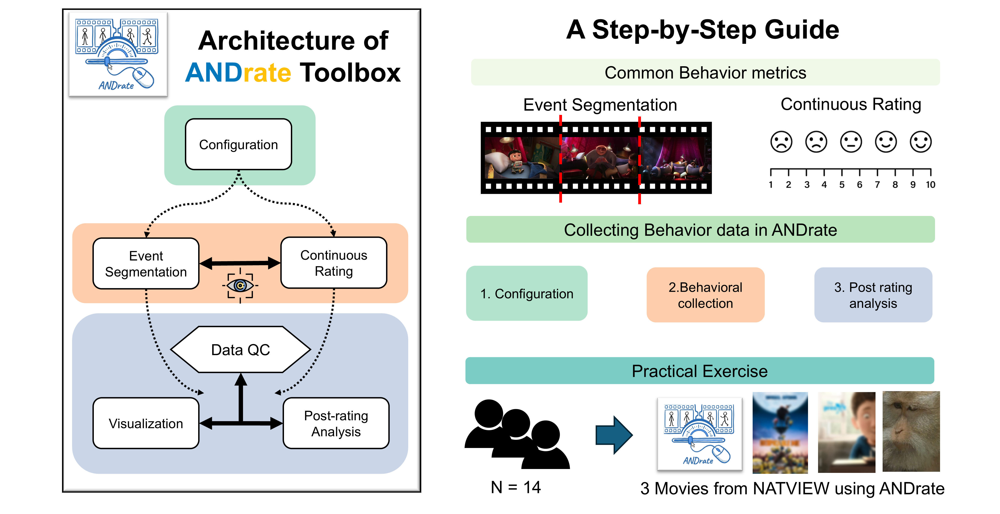

# ANDrate toolbox: A Tutorial for collecting behavioral data in Naturalistic Stimuli in a Python-Based Toolbox
___

 
___
## **Abstract**
Naturalistic stimuli, such as movies, can provide ecological validity and examine human perception and cognition in real-world scenarios. As a result, it is drawing more and more attention from the psychological and cognitive neuroscience community. However, one drawback is that these types of studies usually have no explicit behaviour measures and require raters to provide group-level consensus annotations for the stimuli, such as consensus boundaries and emotional ratings. Here, we introduce ANDrate. ANDrate is an open-source annotation toolbox; it implements boundary segmentation, event annotation, and continuous two-dimensional measurement reporting. The toolbox also supports webcam recording capabilities to ensure data quality. Finally, ANDrate implements algorithms for calculating consensus boundaries and ratings, and enables visualization and the export of standard data formats. It is particularly well-suited for applications in naturalistic experiments, such as research providing continuous emotional states and event cognition for films. 
___
## **Introduction**

In this repo, you can find:

* ANDrate toolbox source code for collecting behavior data 
* Data collected on viewing three videos from NATVIEW as shown in the preprint for more details

In short, ANDrate contains custom configuration for various naturalistic data collection, including video as well as audio stimuli. ANDrate also support collecting behavioral data, including event segmentation and continuous rating, and comes with an eye tracking module that is based on web camera. Finially, the toolbox also contains post-hoc anlaysis, including data QC, post-rating analysis and visualization. The toolbox also comes with a comprehensive step-by-step guide, for more, see [**ANDrate Toolbox**]().

___
## **Downloads**
* The latest release of ANDrate will be available on https://github.com/haiyan0305/ANDrate/releases
* Documentation for ANDrate can be accessed via the wiki at https://github.com/haiyan0305/ANDrate/wiki
* Issues can be reported and features can be requested at https://github.com/haiyan0305/ANDrate/issues

___
## **Citations**
Users must agree to cite the following article in all publications making use of ANDrate:

Wang, E. R. R., Jing, R. & Wu, H. (2018). ANDrate toolbox: A Tutorial for collecting behavioral data in Naturalistic Stimuli in a Python-Based Toolbox. bioRxiv.
___
## **Video Datasets**

Please see [**NATVIEW datasets**](https://github.com/NathanKlineInstitute/NATVIEW_EEGFMRI/tree/main/stimulus) for more details. Please contact the author to remove video if there is any copyright concerns.

___
## **Contact**

Please contact [**Eric R.W. Wang**](ericwang@um.edu.mo) or Rui Jing for any question
